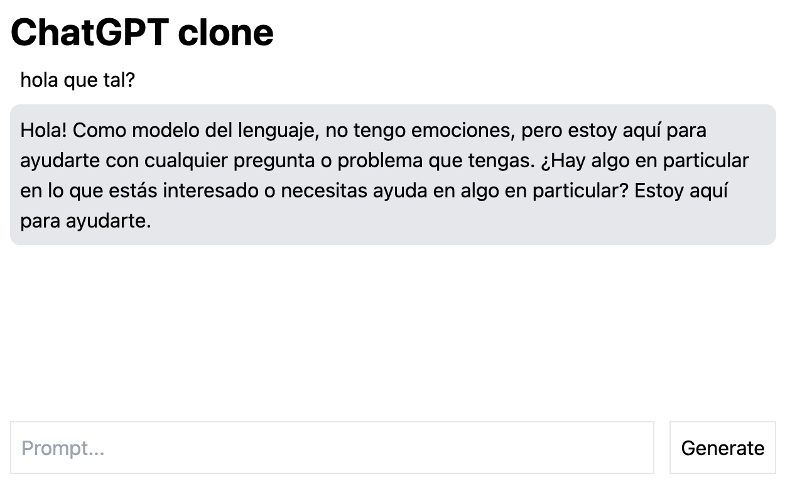

# ChatGPT clone

This is a clone of ChatGPT using [Open Assistant](https://huggingface.co/OpenAssistant).

## Dependencies

- Docker
- Docker Compose
- Nvidia Docker
- Nvidia GPU with at least 24GB of memory

## Instructions

Build the docker images

```
docker-compose build
```

Start the docker containers

```
docker-compose up
```

The API will be available at [http://localhost:8000](http://localhost:8000), with interactive docs at [http://localhost:8000/docs](http://localhost:8000/docs). Check the logs since it may take some time to download the model and load everything.

The UI will be available at [http://ocalhost:5173](http://ocalhost:5173).

